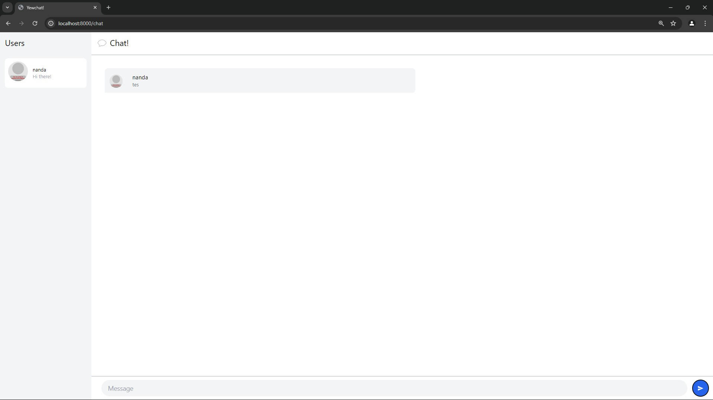
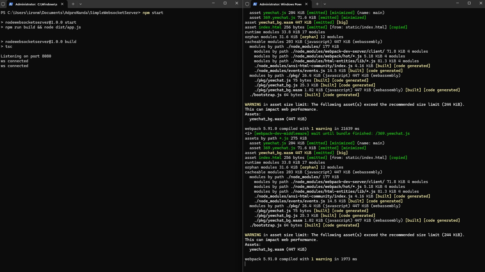

# Module 10 - Asynchronous Programming - YewChat

> ##### Nanda Nathaniela Meizari - 2206824136

## Experiment 3.1: Original code

#### Final tutorial App

Tampilan YewChat

#### Terminal

Terminal dari `SimpleWebSocketServer` yang berjalan di port 8080 dan client `YewChat`

## Experiment 3.2: Be Creative!

Sekarang warna dari chat nya saya ubah dengan theme login agar memberikan warna yang serasi. Disini saya mengubah dan menambahkan styles dari html nya dengan tailwind